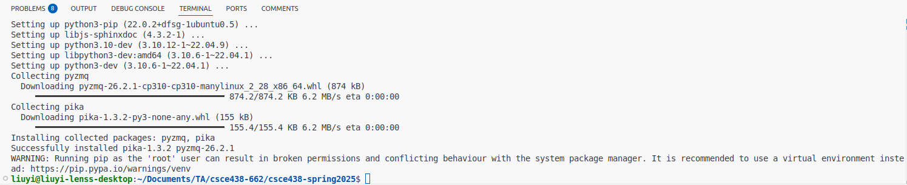
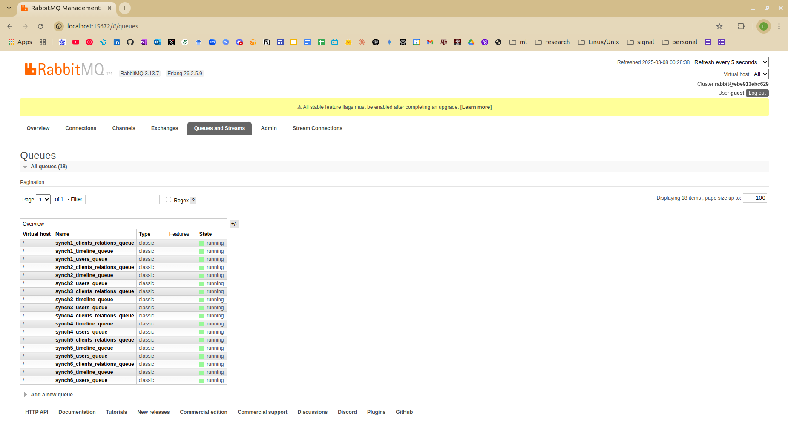

# 1. On a ubuntu terminal, create a rabbitmq container that can communicate with your newly created csce438_mp2_2_container

Instead of using one giant container, we use two docker containers as docker containers are supposed to be lightweight. One container that consumes too much resources may be slow.

## 1.1 create a folder for your MP2.2

Like what we did in 2.1, copy the folder of your MP2.1 to a new folder named `mp2_2`. Copy the 7 source code files in this `mp2-2_skeleton` folder to the created `mp2_2` folder: synchronizer.cc, coordinator.proto, Makefile, startup.sh, stop.sh, setup.sh, docker-compose.yml. Enter into the `mp2_2` folder:

    cd mp2_2

## 1.2. create a local docker image with your mp2.1 container
On ubuntu terminal, in `mp2_2` folder, save your `csce438_mp2_1_container` used in MP2.1 into a local docker iamge named `csce438_mp2_2_image`. This `csce438_mp2_2_image` will serves as a key starting point for MP2.2:

    docker commit -m "mp2.2 starting point" -a "Author Name" csce438_mp2_1_container csce438_mp2_2_image

You can use `docker images` to check if you have a local image named `csce438_mp2_2_image`

## 1.3 create 2 containers using the docker compose yaml file

On ubuntu terminal, install the `docker-compose`:

    sudo apt-get install docker-compose -y

Use `docker-compose` to create 2 containers (`rabbitmq_container` and `csce438_mp2_2_container`). The 2 containers can talk through the inter-container communication bridge `rabbitmq_net`:

    docker-compose up -d

Enable rabbitmq_stream and rabbitmq_stream_management plugins for `rabbitmq_container`:

    docker exec rabbitmq_container rabbitmq-plugins enable rabbitmq_stream rabbitmq_stream_management

Enter into the `csce438_mp2_2_container`:

    docker exec -it csce438_mp2_2_container bash -c "cd /home/csce438/mp2_2 && exec /bin/bash"

Make the setup script executable and execute the `setup.sh`. You would be able to see the information shown in the picture below:

    chmod +x setup.sh 
    ./setup.sh 

# 2. Viewing the activity in the RabbitMQ queues during development: 

You can visit the RabbitMQ Management Plugin UI at http://localhost:15672/ on your ubuntu VM and login with the credentials: 

    Username: guest
    Password: guest

The management UI is very useful and is implemented as a single page application which relies on the HTTP API. Some of the features include: Declare, list and delete exchanges, queues, bindings, users, virtual hosts and user permissions.

# 3. try compiling and using provided synchronizer:

In the `mp2_2` folder of `csce438_mp2_2_container`, compile the code (provided MP2.2 synchronizer + your MP2.1) using the provided mp2.2 makefile:

    make -j4

To clear the directory (and remove .txt files):
   
    make clean

Use `stop.sh` to kill all processes:

    ./stop.sh

Use `startup.sh` to launch the coordinator, tsd, and synchronizers:

    ./startup.sh

After `startup.sh`, on the RabbitMQ Management Plugin UI at http://localhost:15672/, you should be able to see the similar pic shown below, i.e., 3 x 6 = 18 queues. Now, you can check out `TestCasesMP2.2.xlsx` for test cases and proceed your coding. 

# 4. during development/test, you might find the commands below useful

To avoid the inteferences of residual messages from the message queues, in the `rabbitmq_container`:

    rabbitmqctl stop_app
    rabbitmqctl reset 
    rabbitmqctl start_app

To avoid the inteferences from residual files, in `csce438_mp2_2_container`:

    rm -rf /dev/shm/*
    rm -rf ./cluster_*

# 5. Trouble shooting and clarifications

## 5.1 Buggy rabbitMQ skeleton code in synchronizer.cc

Thanks to our classmate Ivan Zaplatar: 

> * Firstly, we shouldn't consume from anyone elses queue except ours as that would prevent another synchronizer from reading that message. 
> * Secondly, amqp_consume_message() takes an envelope argument which is a amqp_envelope_t and has information on which queue the message was consumed from which wasn't being used in the starter code. So calling amqp_consume_message() could give us three different kinds of messages, 2 of which wouldn't be the message we wanted. That's why I saw wrong messages because we never used the amqp_envelope_t to correctly route our data. I now instead have a single consumeMessages() function that consumes a message then routes it accordingly after inspecting the envelope.

## 5.2 The original slave Syncrhonizer F_S2 becomes a master Synchronizer on cluster 2

> In the manual it states: "Follower Synchronization processes on the Slave machines do not send updates to other Follower Synchronization processes." so why would the slave be able to advertise the existence of user 5 in test case 3 of MP2.2?

The manual is correct. After the original M2 is killed, the original slave S2 becomes the new Master on cluster 2. Accordingly, the original master Synchronizer F_M2 becomes a slave Synchronizer (and being orphaned) and the original slave synchronizer F_S2 is not a slave synchronizer anymore. Instead, original slave synchronizer F_S2 becomes the master synchronizer for cluster2.

In this way, after you killed the original master server on cluster2, u5 would interact with the new master server (i.e., original slave server) on cluster2. The original slave machine becomes a new master machine. The original synchronizer F_S2 for the original slave machine on cluster2 will be responsible to send u5’s information to other clusters.