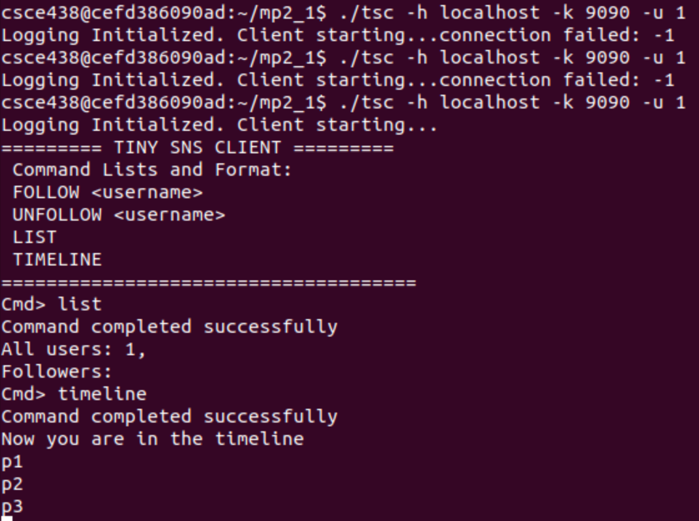
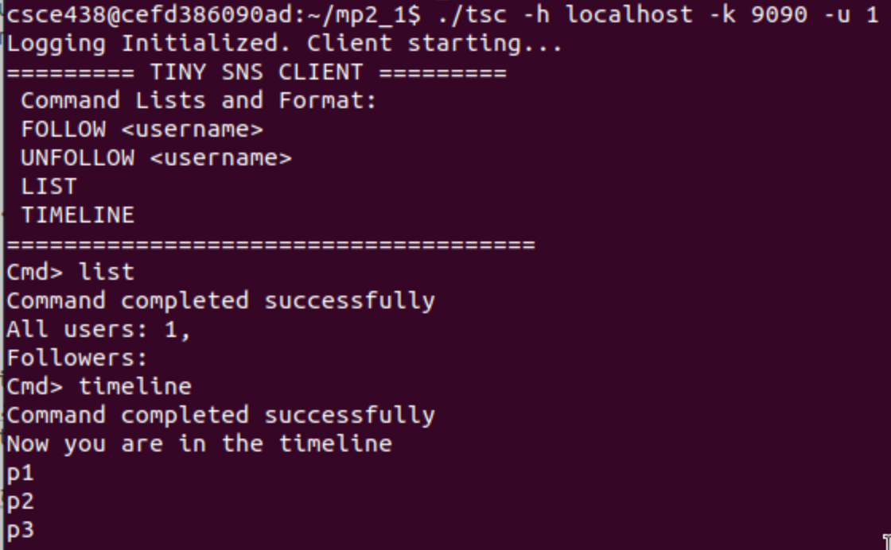
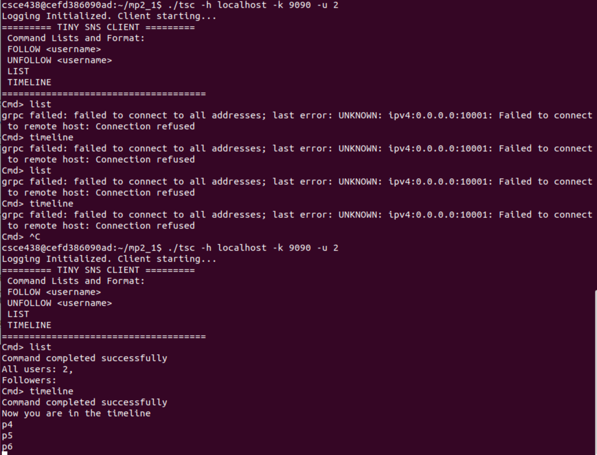

# System Design Document

## Build

    docker build --platform linux/arm64 -t csce438_env .

    docker run -it --name csce438_mp2_1_container -v $(pwd)/mp2_1:/home/csce438/mp2_1 liuyidockers/csce438_env:latest

    ./setup-438-env.sh

    cd mp2_1

## Run

Compile the code using the provided makefile:

    make -j4

To clear the directory (and remove .txt files):

    make clean

To run the coordinator without glog messages:

    ./coordinator -p <portNum>

To run the coordinator with glog messages:

    GLOG_logtostderr=1 ./coordinator -p 9090

To run the server without glog messages (port number is optional):

    ./tsd -c <clusterId> -s <serverId> -h <coordinatorIP> -k <coordinatorPort> -p <portNum>

To run the server with glog messages:

    GLOG_logtostderr=1 ./tsd -c <clusterId> -s <serverId> -h <coordinatorIP> -k <coordinatorPort> -p <portNum>

To run the client, you need to open another terminal window, and enter into the launched docker container:

    docker exec -it csce438_container bash
    cd mp2_1
    ./tsc -h <coordinatorIP> -k <coordinatorPort> -u <userId>

To run the server with glog messages:

    GLOG_logtostderr=1 ./tsc -h <coordinatorIP> -k <coordinatorPort> -u <userId>

## Components

### 1. Coordinator

The server is responsible for managing user accounts, handling follow/unfollow requests, and maintaining user timelines. It provides the following gRPC services:

- `Login(Request) returns (Reply)`: Handles user login requests.
- `List(Request) returns (ListReply)`: Returns a list of all users and the followers of the requesting user.
- `Follow(Request) returns (Reply)`: Allows a user to follow another user.
- `UnFollow(Request) returns (Reply)`: Allows a user to unfollow another user.
- `Timeline(stream Message) returns (stream Message)`: Handles bidirectional streaming for user timelines.

#### Server Implementation

The server is implemented in `tsd.cc` and uses the following classes and functions:

- `SNSServiceImpl`: Implements the gRPC service methods.
  - `Login`: Handles user login requests. Checks if the user is already connected or never existed. If the user never existed, creates a new user and sets it to connected. If the user is already connected, the connection fails.
  - `List`: Returns a list of all users and the followers of the requesting user.
  - `Follow`: Allows a user to follow another user. Updates the `client_db` by adding the follower to the user's followers list and the user to the follower's following list.
  - `UnFollow`: Allows a user to unfollow another user. Updates the `client_db` by removing the follower from the user's followers list and the user from the follower's following list.
  - `Timeline`: Handles bidirectional streaming for user timelines. The client sends an init message to retrieve any posts that were already sent from the `<user>_following.txt` files. Updates the `client_db` by setting the current client's stream to the stream passed in. Transitions to updating the followers' timelines whenever something is posted and also writes to the followers' timeline files.
- `Client`: Represents a user in the system.
- `getClient`: Retrieves a `Client` object by username.
- `appendTo`: Appends a message to a user's timeline file.
- `getLastNPosts`: Retrieves the last N posts from a user's following timeline file.

### 2. Client

The client allows users to interact with the server, follow/unfollow other users, list users and followers, and post messages to their timelines. It provides the following commands:

- `FOLLOW <username>`: Follows the specified user.
- `UNFOLLOW <username>`: Unfollows the specified user.
- `LIST`: Lists all users and the followers of the current user.
- `TIMELINE`: Enters timeline mode, allowing the user to post messages and see messages from users they follow.

#### Client Implementation

The client is implemented in `tsc.cc` and uses the following classes and functions:

- `Client`: Implements the client functionality.
  - `connectTo`: Connects to the server and logs in the user. Creates a stub for the gRPC service and calls the `Login` method.
  - `processCommand`: Processes user commands and calls the appropriate service methods. Parses the input command and calls the corresponding method (`Follow`, `UnFollow`, `List`, or `Timeline`).
  - `processTimeline`: Enters timeline mode and handles posting and receiving messages. Calls the `Timeline` method and handles bidirectional streaming.
  - `Login`: Logs in the user. Sends a login request to the server and handles the response.
  - `List`: Lists all users and the followers of the current user. Sends a list request to the server and handles the response.
  - `Follow`: Follows the specified user. Sends a follow request to the server and handles the response.
  - `UnFollow`: Unfollows the specified user. Sends an unfollow request to the server and handles the response.
  - `Timeline`: Handles bidirectional streaming for user timelines. Sends an init message to the server to retrieve any posts that were already sent from the `U_following.txt` files. Updates the `client_db` by setting the current client's stream to the stream passed in. Transitions to updating the followers' timelines whenever something is posted and also writes to the followers' timeline files.
- `IClient`: Provides an interface for the client.
  - `run`: Runs the client. Displays the client title and command list, gets commands from the user, and processes the commands.
  - `displayTitle`: Displays the client title and command list.
  - `getCommand`: Gets a command from the user.
  - `displayCommandReply`: Displays the result of a command.
  - `toUpperCase`: Converts a string to uppercase.
- `getPostMessage`: Gets a message from the user.
- `displayPostMessage`: Displays a message from another user.

## Test Cases

### 1.

### 2.

### 3.

