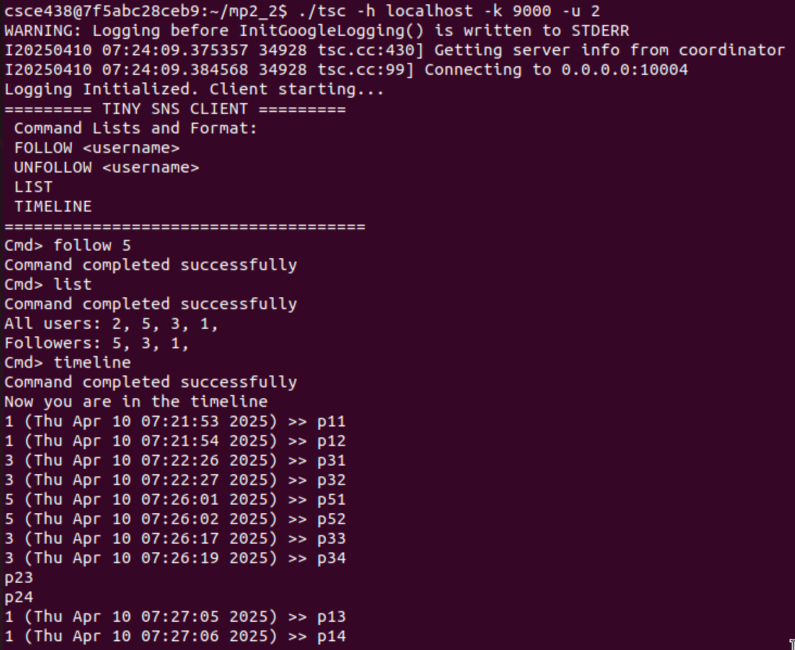
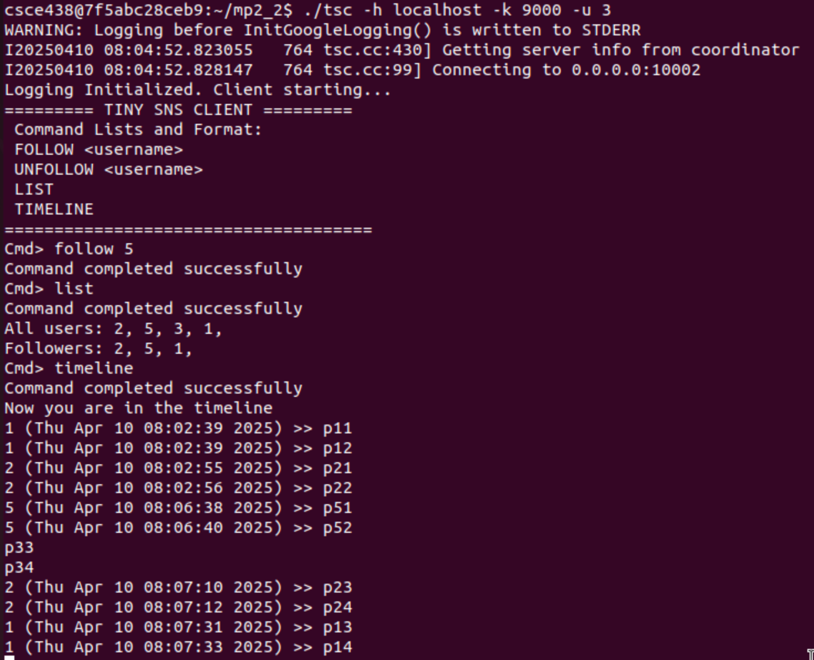

# System Design

## Build

    cd mp2_2

    docker commit -m "mp2.2 starting point" -a "Author Name" csce438_mp2_1_container csce438_mp2_2_image

    sudo apt-get install docker-compose -y

    docker-compose up -d

    docker exec rabbitmq_container rabbitmq-plugins enable rabbitmq_stream rabbitmq_stream_management

    docker exec -it csce438_mp2_2_container bash -c "cd /home/csce438/mp2_2 && exec /bin/bash"

    chmod +x setup.sh
    ./setup.sh

Compile the code using the provided makefile:

    make -j4

To clear the directory (and remove .txt files):

    make clean

## Run

To run the coordinator without glog messages:

    ./coordinator -p <portNum>

To run the coordinator with glog messages:

    GLOG_logtostderr=1 ./coordinator -p 9090

To run the server without glog messages (port number is optional):

    ./tsd -c <clusterId> -s <serverId> -h <coordinatorIP> -k <coordinatorPort> -p <portNum>

To run the server with glog messages:

    GLOG_logtostderr=1 ./tsd -c <clusterId> -s <serverId> -h <coordinatorIP> -k <coordinatorPort> -p <portNum>

To run the synchronizer without glog messages (port number is optional):

    ./synchronizer -h <coordinatorIP> -k <coordinatorPort> -p <portNum> -i <synchID>

To run the synchronizer with glog messages:

    GLOG_logtostderr=1 ./synchronizer -h <coordinatorIP> -k <coordinatorPort> -p <portNum> -i <synchID>

## 1. Synchronizer

The Synchronizer has two main components:

### Heartbeat

The Synchronizer sends a heartbeat message every 5 seconds to the Coordinator. This message includes its ID, allowing the Coordinator to track its liveness. The Coordinator's confirmation reply includes a boolean value indicating whether the Synchronizer is designated as the master for its cluster.

- If the Synchronizer is a master, it writes its files to the directory `cluster_c\1`.
- If the Synchronizer is a slave, it writes its files to the directory `cluster_x\2`.

### Publish & Consume

There are three Publish and Consume RabbitMQ queues. The `consumerThread` handles the routing of messages from these queues, inspecting each message and directing it to the appropriate consume function. Additionally, all file access within the Synchronizer is protected using named semaphores.

#### 1. UserList

- **Publisher:** Reads the `all_users.txt` file located in its cluster directory. It then compiles a JSON object named `users` containing the extracted user information and publishes this object to the designated RabbitMQ queue for user list processing.

- **Consumer:** Receives the JSON object containing user data. It iterates through the users and adds each user to an in-memory list. Subsequently, it checks if each user is already present in its local `all_users.txt` file. If a user is not found, they are appended to the file.

#### 2. ClientRelations

- **Publisher:** Begins by reading the `all_users.txt` file to obtain a list of all users tracked within its cluster. For each user _not_ in its own cluster, it iterates through all clients within its cluster. If a client follows the currently examined user, an entry is added to a JSON list container with the format `"User": ["Follower 1", "Follower 2"]`. The publisher then contacts the Coordinator to determine the appropriate Synchronizer queue(s) to publish to and sends the generated JSON data.

- **Consumer:** Processes the received JSON data, which contains users and their followers from other clusters. For each follower associated with a user in the queue, the consumer checks if that follower already exists in its local `u_followers.txt` file. If the follower is not present, it is added to the file.

#### 3. Timelines

- **Publisher:** For every client within its cluster, the publisher creates a JSON object containing all of that client's posts. It then retrieves the list of followers for each client by consulting the `u_followers.txt` file. Next, it contacts the Coordinator, providing the client's ID, to determine which Synchronizer queue(s) it should send the timeline data to.

- **Consumer:** Maintains a hashmap to track how much of each client's timeline has already been published to its followers. Within its processing loop, the consumer appends each new post to the respective `u_following.txt` file of each follower.

## 2. Coordinator

### Heartbeat

The heartbeat function was significantly modified to handle the assignment of master and slave roles for both Synchronizers and Servers within each cluster. The master assignment policy involves checking if any other Synchronizer or Server in the same cluster is already a master. If no master is currently present, the Coordinator designates the reporting component as the master in its confirmation reply. Furthermore, the `checkHeartbeat` thread now monitors heartbeat messages from both Synchronizers and Servers. If a component misses a heartbeat, it is demoted to a slave.

### 1. GetAllFollowerServers

This function returns a list containing the IDs of all other Synchronizers, excluding the one that initiated the request. This is particularly useful for operations that require broadcasting information to all other Synchronizers, such as during the `publishUserLists` process.

### 2. GetFollowerServers

This function accepts a `clientID` as input and returns a list of the Synchronizers that belong to the same cluster as the client. The returned list (`serverlist`) includes both the master and slave Synchronizers within that cluster.

### 3. GetSlaves

This function was specifically created to allow master Servers to identify the slave Servers within their cluster to which client commands need to be forwarded. It takes a `clusterID` as input and returns a list of all slave Servers belonging to that specified cluster.

## 3. Server

An effort was made to abstract all file synchronization operations into a separate thread. This design choice aims to keep the gRPC call handlers relatively clean and consistent. For `follow` and `login` requests, if a Server is the master for its cluster, it contacts the Coordinator to obtain a list of all slave Servers within the same cluster and forwards the client command to them as well.

To ensure the in-memory `client_db` data structure remains synchronized with the persistent files (`all_users.txt`, `u_follow_list.txt`, and `u_following.txt`), a dedicated database thread (`db thread`) was implemented. This thread handles bidirectional synchronization: writing data from the files into `client_db` and persisting changes from `client_db` back to the files.

### Timeline

For managing timelines, an additional thread was created to monitor the `u_following.txt` file for new posts. When new content is detected, this thread writes the new posts to the client's stream. A hashmap is used to track the number of posts delivered to each client. If a `stream->write()` operation fails, it is interpreted as a client disconnection, and the thread for that client is terminated.

The read thread is responsible for handling incoming posts. It appends each received post to the client's local `u_timeline.txt` file. Additionally, to maintain intra-cluster consistency, if the receiving client is followed by other clients within the same cluster, the received post is also appended to the `u_following.txt` file of those followers.

## Test Cases

### 1.

### 2.

### 3.

